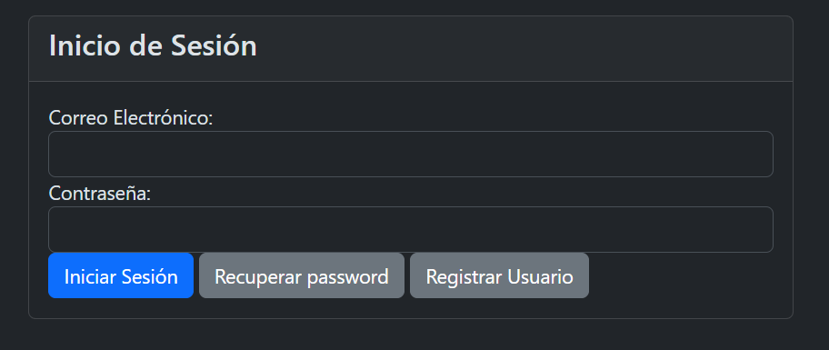

# usuariofacil
# Nombre del Proyecto

## Descripción

"Construyendo un Carrito de Compras desde Cero: Prácticas de Arquitectura de Software"
En este video te presento el sistema de información que hemos creado desde cero, aplicando rigurosas prácticas de arquitectura de software. Se trata de un emocionante recorrido por un Website diseñado especialmente como un carrito de compras, donde cada detalle ha sido cuidadosamente elaborado para ofrecer una experiencia de usuario óptima. Desde la gestión de transacciones hasta un completo dashboard para clientes, te mostraré cada funcionalidad detalladamente a lo largo del curso.

Desde la página principal hasta la gestión de usuarios y productos, cada aspecto se aborda con claridad y profundidad. ¡No te pierdas este curso práctico diseñado para aquellos con conocimientos previos en computación que desean llevar sus habilidades al siguiente nivel!

## Capturas de Pantalla





## Características Principales

- Se trata de un sistema de e-commerce en donde podrás aprender a crear los elementos básicos de un website tanto como del lado del front end asi como del backend. Cada uno de los modulos se explica y se realizan paso a paso. Todo el código está disponible en el repositorio de Github.

## Tecnologías Utilizadas

- Para el desarrollo del proyecto se utilizo lo siguiente: javascript, ccs3, html5, php 8.3, jquery, bootstrap, sweet alert.

## Instalación

El deploy se realizo a traves de filezilla y tambien usando cpanel en el servidor.

```bash

